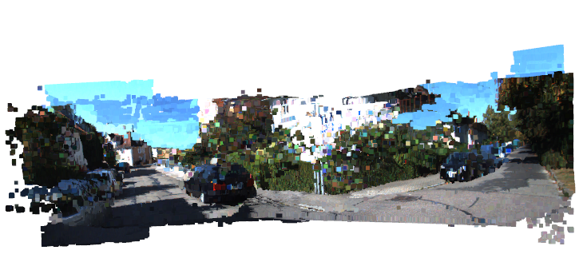

# Stereo reconstruction and Non-linear optimization¶
Project done as part of Mobile Robotics course at IIIT Hyderabad.

### Repository structure
* [Stereo dense reconstruction and Motion estimation using iterative PnP](https://github.com/avani17101/Stereo-reconstruction-and-Non-linear-optimization/blob/main/Project_2_spacex_partA.ipynb)
* [Bundle Adjustment and SfM](https://github.com/avani17101/Stereo-reconstruction-and-Non-linear-optimization/blob/main/partB.ipynb)

## Data
Download data from 
[here](https://github.com/avani17101/Stereo-reconstruction-and-Non-linear-optimization.git)
and place in "Data" folder in root.

## [Stereo dense reconstruction and Motion estimation using iterative PnP](https://github.com/avani17101/Stereo-reconstruction-and-Non-linear-optimization/blob/main/Project_2_spacex_partA.ipynb)
### Stereo dense reconstruction
3-D point clouds are very useful in robotics for several tasks such as object detection, motion estimation (3D-3D matching or 3D-2D matching), SLAM, and other forms of scene understanding. Stereo cameras provide us with a convenient way to generate dense point clouds. Dense here, in contrast to sparse, means all the image points are used for the reconstruction. 
Generated a dense 3D point cloud reconstruction of a scene from stereo images.
#### Result

### Motion estimation using iterative PnP
Using the generated reconstruction from the previous part, synthesize a new image taken by a virtual monocular camera fixed at any arbitrary position and orientation. 
Recovered this pose using an iterative Perspective-from-n-Points (PnP) algorithm.

## [Bundle Adjustment and SfM](https://github.com/avani17101/Stereo-reconstruction-and-Non-linear-optimization/blob/main/partB.ipynb)
* Bundle Adjustment using scipy
* A short review on Transformations
* A short review on camera modelling & radial distortion
* SfM pipeline 
* Initializing R,t and 3D points for SfM given 2 images(using opencv functions)

